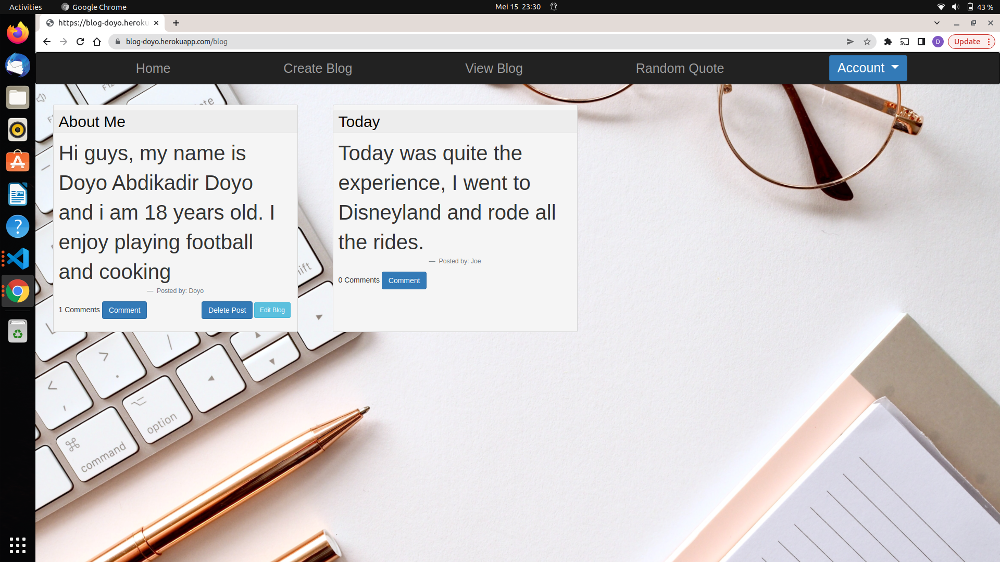
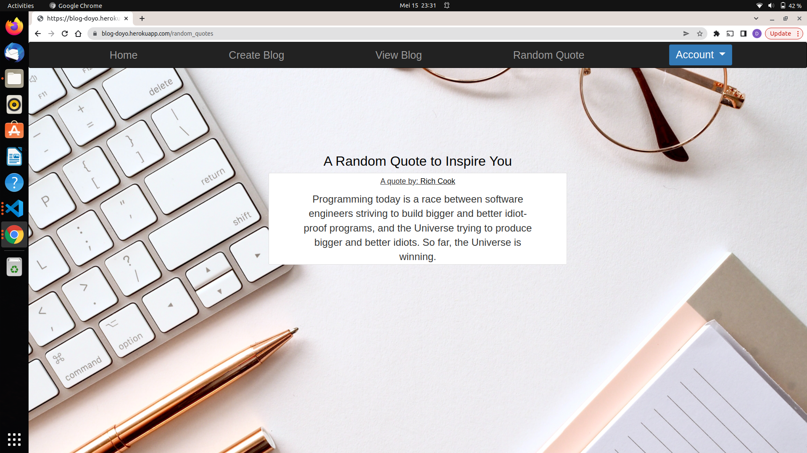
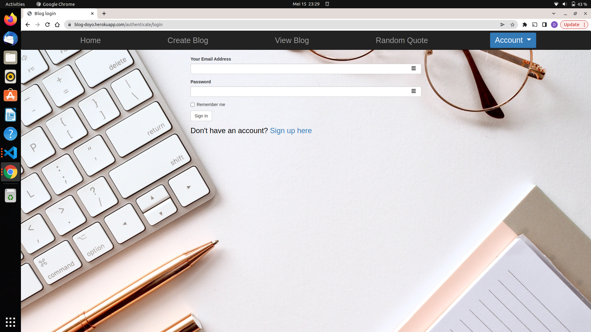

# Blog
## BY DOYO ABDIKADIR DOYO

## Description
### Save the moments that matter. This website lets you safely store thousands of posts. Write daily blogs that are unique to be displayed to your audience.You will be able to see all blogs, and be able to edit or delete your on blog.

## Screenshots
All Blogs

Random Quote Page

Login Page

## Setup Instructions
### Clone or download and unzip the repository from github,https://github.com/Doyo54/Python-flask-week-4-IP . Then to run the application, open the cloned file in terminal and run the command:
-  python3 manage.py server

## Technologies Used
- Python3.9

## Known Bugs
No known bugs

## Copyright and license information
### The app is open source and in compliance with MIT License Copyright (c) 2022 {Doyo Abdikadir Doyo}